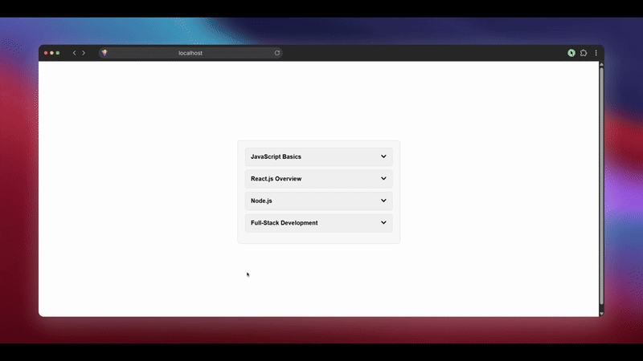

# React Accordion Component
A simple, reusable Accordion component built with React. This component displays a list of expandable/collapsible items with smooth toggle functionality and icon indicators.

## Features
Clean and minimal design with CSS styling

Expand/collapse functionality with state management using React hooks

Uses react-icons for arrow indicators

Responsive and centered layout on the screen

Easy to customize and integrate into any React project

## Getting Started

1. **Clone the repository**
git clone https://github.com/thaanis-off/accordian-react-interview.git

2. **Navigate to the project directory**
cd accordian-react-interview

3. **Install dependencies**
npm i

4. **Start the development server**
npm run dev

